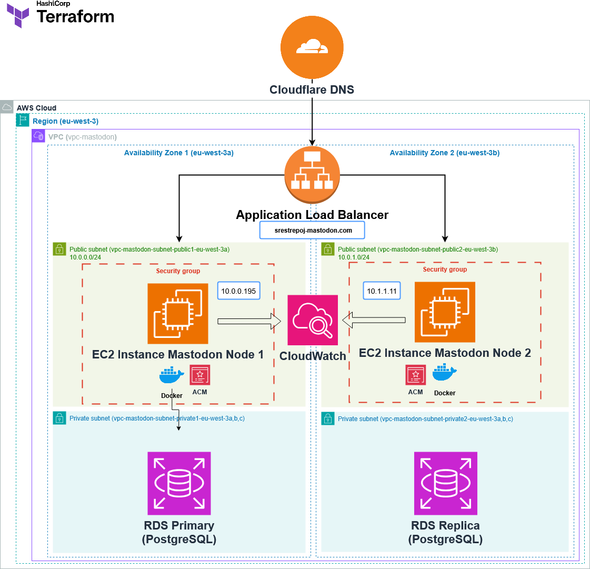

# Arquitectura en AWS

Este proyecto implementa una infraestructura escalable y segura en AWS utilizando herramientas modernas de despliegue.

## Características principales

- **Infraestructura como Código (IaC)**: Despliegue reproducible con Terraform.
- **Arquitectura en AWS**:
  - **EC2**: Instancias para aplicaciones y servicios.
  - **RDS**: Base de datos gestionada (PostgreSQL).
  - **ALB**: Balanceo de carga y terminación SSL.
  - **ACM**: Gestión automática de certificados SSL/TLS.
  - **S3 + CloudFront**: Distribución de contenido estático.
  - **Alta disponibilidad**: Instancias distribuidas en múltiples zonas de disponibilidad (AZ).
  - **Seguridad reforzada**:
    - Certificados SSL/TLS gestionados por AWS Certificate Manager (ACM).
    - Firewalls (Security Groups).
    - IAM con mínimos privilegios.
  - **Monitorización**: Integración con Amazon CloudWatch para métricas y alertas.

## Diagrama de la arquitectura

